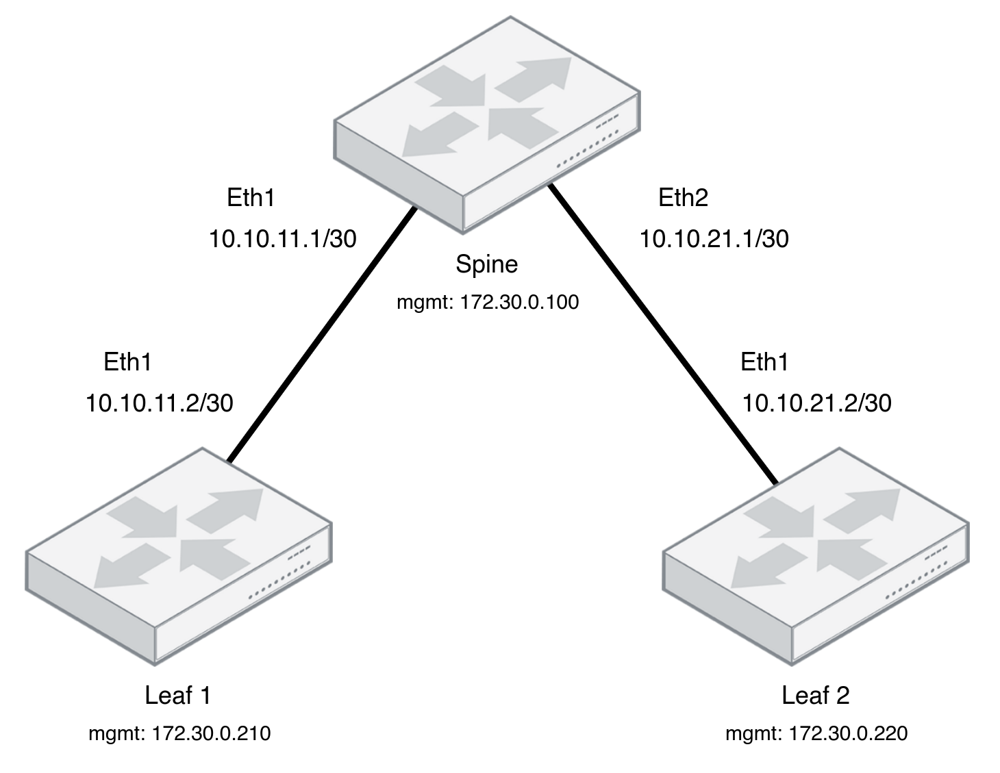

# SR Linux Module

Table of contents:

- [SR Linux Module](#sr-linux-module)
  - [Introduction](#introduction)
  - [SR Linux Topology](#sr-linux-topology)
  - [Using The Open-source Inmanta Service Orchestrator](#using-the-open-source-inmanta-service-orchestrator)
  - [Starting The Containers](#starting-the-containers)
  - [Connecting to the Inmanta Container](#connecting-to-the-inmanta-container)
    - [Create a New Environment](#create-a-new-environment)
  - [Connecting to the SR Linux Containers](#connecting-to-the-sr-linux-containers)
  - [Applying the examples](#applying-the-examples)
  - [Additional Commands](#additional-commands)

## Introduction

This repository showcases our `SR Linux` module and has a few examples to get you started with Inmanta.

The provided examples in the `*.cf` files can be applied on `SR Linux` devices either on:

- A device that you already have and by changing the IP address, port, etc... in the examples files
- Or using [containerlab](https://containerlab.srlinux.dev/) with the provided [topology file](containerlab/topology.yml).

  > Install containerlab using [this link](https://containerlab.dev/install)

In case of choosing the `containerlab` option, it is worthwhile to mention that you need to have a `SR Linux` Docker image present on the host machine running `containerlab` and having it **tagged** similar to the topology file; in this case: `ghcr.io/nokia/srlinux`.

The `SR Linux` docker image can be pulled using:

```bash
sudo docker pull ghcr.io/nokia/srlinux
```

Furthermore, if the `SR Linux` docker image is missing on your machine, it will be pulled by the `Containerlab` automatically.

## SR Linux Topology

The `SR Linux` topology alongside the IP addresses is depicted as follows:



## Using The Open-source Inmanta Service Orchestrator

Inmanta [Service Orchestrator](https://inmanta.com/service-orchestrator/) is another containerized piece that can supply a GUI, providing many useful information such as deployment process, agents status and so much more. This container can be manually pulled by:

```bash
sudo docker pull ghcr.io/inmanta/orchestrator:latest
```

> NOTE: This container will automatically get pulled by Containerlab if you skip the command above.

## Starting The Containers

In order to deploy the provided topology file with `containerlab` go to the containerlab folder where the topology file is present and run:

```bash
cd containerlab
sudo clab deploy -t topology.yml
```

This command will spin-up three `SR Linux` containers, an `Inmanta server` and a `PostgreSQL` container.

> **Note:** It will take a few seconds up to minutes to fully boot-up the containers depending on your system horsepower.

## Connecting to the Inmanta Container

Open up a browser and connect to the Inmanta container using this URL <http://172.30.0.3:8888>.

### Create a New Environment

After connecting to the Inmanta container, you can create a new environment by clicking on the `Create new environment` button. Then you need to copy the environment ID either:

- from the URL, e.g. `ec05d6d9-25a4-4141-a92f-38e24a12b721` from the `http://172.30.0.3:8888/console/desiredstate?env=ec05d6d9-25a4-4141-a92f-38e24a12b721`.
- or by clicking on the gear icon on the top right of the Web Console, then click on `Environment`, scroll down all the way to the bottom of the page and copy the environment ID.

> Additionally, you can prepare a [development environment](#applying-the-examples) and achieve the same goal through `inmanta-cli` by referring to the last section of [additional commands](#additional-commands)

## Connecting to the SR Linux Containers

You can connect to the containers in two ways:

1. Using Docker:

   ```bash
   docker exec -it clab-srlinux-spine sr_cli
   # or
   docker exec -it clab-srlinux-leaf1 sr_cli
   # or
   docker exec -it clab-srlinux-leaf2 sr_cli
   ```

2. Using SSH (username and password are `admin`):

   ```bash
   ssh admin@clab-srlinux-spine
   ssh admin@clab-srlinux-leaf1
   ssh admin@clab-srlinux-leaf2
   ```

Then enter the configuration mode by typing:

```bash
enter candidate
```

The output should look something like this:

```txt
Welcome to the srlinux CLI.
Type 'help' (and press <ENTER>) if you need any help using this.


--{ running }--[  ]--
A:spine#
```

## Applying the examples

In order to run the provided examples, you need to prepare a development environment using **Python 3.9** by creating a `Python virtual environment` and installing the required packages:

Check the current Python version:

```bash
$ python3 -V
Python 3.9.10
```

Create a virtual environment and install `Inmanta`:

```bash
python3 -m venv ~/.virtualenvs/srlinux
source ~/.virtualenvs/srlinux/bin/activate
pip install inmanta
```

Install the project:

```bash
inmanta project install
```

And then, compile the `main.cf` file to make sure you have all the required packages:

```bash
inmanta compile -f main.cf
```

> When `inmanta compile` is run by itself, the implicit behavior is that it always compiles the `main.cf` file. Hence, the command above could simply be `inmanta compile`.

After that, export a model to the server. For example, `interfaces.cf`:

```bash
inmanta -vvv export -f interfaces.cf -e <environment_id> --server_address 172.30.0.3
```

> NOTE: Please make sure to swap the `<environment_id>` with your own environment id.

## Additional Commands

Deploy the LAB:

```sh
sudo clab deploy -t topology.yml
```

View the current LAB state:

```sh
sudo clab inspect -t topology.yml
```

Delete the deployed LAB:

```sh
sudo clab destroy -t topology.yml
```

Export the model to Inmanta server:

```sh
inmanta -vvv export -f main.cf -e <environment_id> --server_address 172.30.0.3
# or
inmanta -vvv export -f interfaces.cf -e <environment_id> --server_address 172.30.0.3
# or
inmanta -vvv export -f ospf.cf -e <environment_id> --server_address 172.30.0.3
```

Create a project and an environment (`test` and `SR_Linux` respectively):

```bash
inmanta-cli --host 172.30.0.3 project create -n test
inmanta-cli --host 172.30.0.3 environment create -p test -n SR_Linux --save
```

By using the `inmanta-cli` command, you can omit the `environment id` and `server ip address` from the `inmanta export` command:

```bash
inmanta -vvv export -f main.cf
# or
inmanta -vvv export -f interfaces.cf
# or
inmanta -vvv export -f ospf.cf
```

Free up the taken disk space by `Docker` using:

```bash
sudo docker system prune
```

Remove the `Docker` images:

```bash
sudo docker rmi -f ghcr.io/inmanta/orchestrator:latest
sudo docker rmi -f ghcr.io/nokia/srlinux:latest
sudo docker rmi -f postgres:13
```
