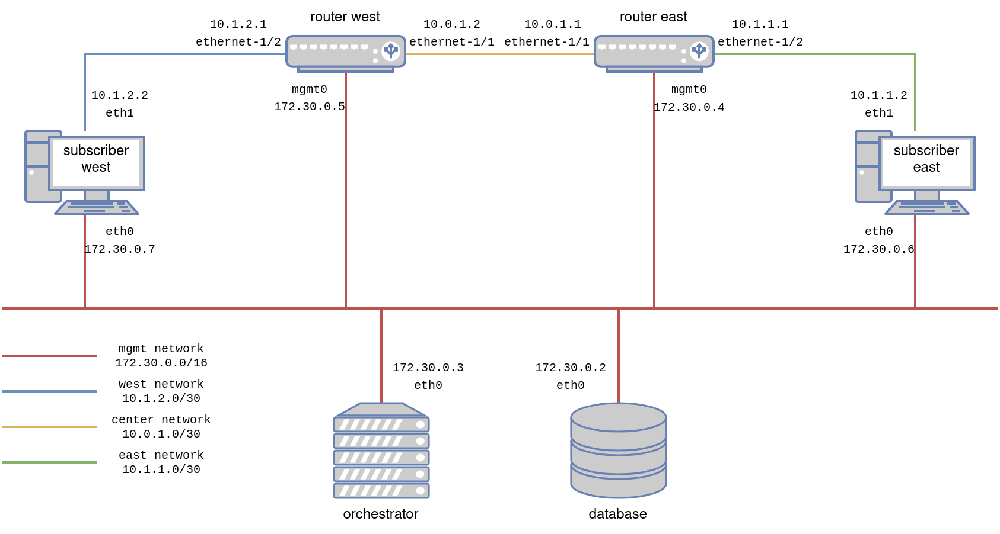

# Manual configuration

In this chapter we configure the lab by hand. The goal is to get familiar with SR linux. It can be safely skipped. 

## Preqrequites

To follow these instructions, you should have alreayd completed the lab setup (either [here (opensource)](lab/readme.md)) or [here (licensed version)](lab-iso/README.md)

## Intro

Despite already being deployed, the routers and subscribers are still not connected to each other. We can test this using `ping`. Here we try to ping from leaf1 to leaf2:

```console
$ssh admin@clab-srlinux-leaf1 
--{ running }--[  ]--
A:admin@leaf1# ping 10.10.21.2
Using network instance mgmt
^CCommand execution aborted : 'ping 10.10.21.2'
```

In this file we will configure the network manually, so that all routers and subscribers are connected and reachable anywhere in the network.

For srlinux cli documentation, see https://documentation.nokia.com/srlinux/SR_Linux_HTML_R21-11/SysMgmt_Guide/cli-interface.html

## Configure the network manually - Routers

1. Enter configuration mode.  Srlinux calls this the `candidate` configuration, in which we can safely make any change of configuration without impacting the router, then apply them all at once, in a single transaction.
    ```console
    --{ running }--[  ]--
    A:admin@leaf1# enter candidate private

    --{ candidate private private-admin }--[  ]--
    ```

2. Configure an interface manually.  We will not enter in the details of how the cli works, srlinux has a lot of great documentation available online for this.  Let's just enter the desired configuration change manually.  This will configure the interface on leaf1, which is connected to router-west.  We also add the interface to a network instance (~vrf) we create, and name `default`.  All the network configuration we will deploy on our routers will go into this network instance.
    ```console
    --{ candidate private private-admin }--[  ]--
    A:admin@leaf1# set / interface ethernet-1/1
        set / interface ethernet-1/1 admin-state enable
        set / interface ethernet-1/1 subinterface 0 admin-state enable
        set / interface ethernet-1/1 subinterface 0 ipv4
        set / interface ethernet-1/1 subinterface 0 ipv4 admin-state enable
        set / interface ethernet-1/1 subinterface 0 ipv4 address 10.10.11.2/30
        set / network-instance default
        set / network-instance default admin-state enable
        set / network-instance default interface ethernet-1/1.0
        set / network-instance default protocols ospf instance 1
        set / network-instance default protocols ospf instance 1 admin-state enable
        set / network-instance default protocols ospf instance 1 version ospf-v2
        set / network-instance default protocols ospf instance 1 router-id 172.30.0.210
        set / network-instance default protocols ospf instance 1 area 0.0.0.0 interface ethernet-1/1.0

    --{ * candidate private private-admin }--[  ]--
    ```


    > :bulb: A few notes about this configuration:
    > - We use ospf-v2 as our links are configured with ipv4 addresses, and ospf-v3 doesn't support that.
    > - We created one area, in which we include all our interfaces, the id of such area doesn't really mather as it is the only one we will ever configure.
    > - We used as router-id the same ip as the mgmt ip for our router.  We could have chosen anything as long as it stays unique amongst the routers we are configuring.
    > - We add the interfaces to the subscribers in the ospf instance configuration, while we don't actually speak ospf with the subscribers (we don't configure it on the subscriber side).  This simplifies the configuration, as the routes to the subscribers will automatically be shared.


3. Visualize the change you are about to push on the router.
    ```console
    --{ * candidate private private-admin }--[  ]--
    A:admin@leaf1# diff
    +     network-instance default {
    +         admin-state enable
    +         interface ethernet-1/1.0 {
    +         }
    +         protocols {
    +             ospf {
    +                 instance 1 {
    +                     admin-state enable
    +                     version ospf-v2
    +                     router-id 172.30.0.210
    +                     area 0.0.0.0 {
    +                         interface ethernet-1/1.0 {
    +                         }
    +                     }
    +                 }
    +             }
    +         }
    +     }
        interface ethernet-1/1 {
    +         subinterface 0 {
    +             admin-state enable
    +             ipv4 {
    +                 admin-state enable
    +                 address 10.10.11.2/30 {
    +                 }
    +             }
    +         }
        }

    --{ * candidate private private-admin }--[  ]--
    ```

4. Commit the change and exit configuration mode.  The configuration proposed above should be accepted without any issue.
    ```console
    --{ * candidate private private-admin }--[  ]--
    A:admin@leaf1# commit now
    All changes have been committed. Leaving candidate mode.

    --{ + running }--[  ]--
    ```

    > :bulb: You can also use `commit stay` to stay in candidate mode.

5. Check the status of the interface we just configured using the `show` command.
    ```console
    --{ + running }--[  ]--
    A:admin@leaf1# show interface ethernet-1/1.0
    ===========================================================================
    ethernet-1/1.0 is up
        Network-instances:
        * Name: default (default)
        Encapsulation   : null
        Type            : routed
        IPv4 addr    : 10.10.11.2/30 (static, preferred, primary)
    ===========================================================================

    --{ + running }--[  ]--
    A:admin@leaf1#
    ```

6. Repeat for the three other interfaces, follow the ip plan presented in the topology here below:
    - [leaf1](manual_configuration/leaf1.cfg)
    - [leaf2](manual_configuration/leaf2.cfg)
    - [spine](manual_configuration/spine.cfg)
    
    

7. Test connectivity in between the routers.  For this we can simply use the ping command.  Pay attention to select the correct network instance! The one in which we configured our interfaces.
    ```
    --{ + running }--[  ]--
    A:admin@leaf1# ping network-instance default 10.10.21.2
    Using network instance default
    PING 10.10.21.2 (10.10.21.2) 56(84) bytes of data.
    64 bytes from 10.10.21.2: icmp_seq=1 ttl=63 time=3.00 ms
    64 bytes from 10.10.21.2: icmp_seq=2 ttl=63 time=4.15 ms
    64 bytes from 10.10.21.2: icmp_seq=3 ttl=63 time=2.49 ms
    64 bytes from 10.10.21.2: icmp_seq=4 ttl=63 time=3.03 ms
    64 bytes from 10.10.21.2: icmp_seq=5 ttl=63 time=2.51 ms
    ^CCommand execution aborted : 'ping network-instance default 10.10.21.2'
    ```

    If the ping doesn't go through, you probably missed something in the configuration of the interfaces. Try to figure out yourself what is wrong and enjoy the thought that you will learn to automate all of this very soon.


