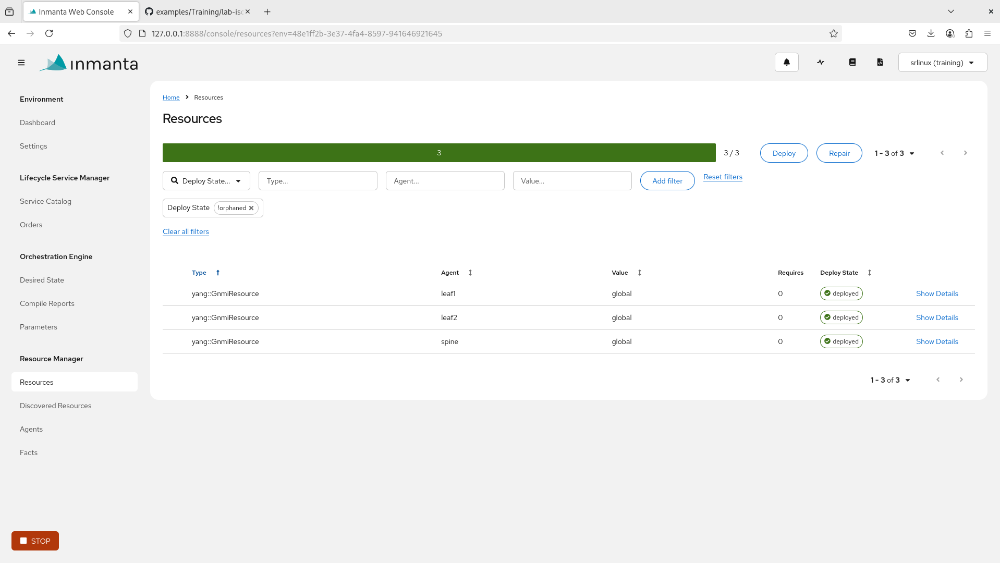

# Configure the network with the orchestrator

## Prerequisites

To follow these instructions, you should have already completed the lab setup (either [here (opensource)](lab/readme.md)) or [here (licensed version)](lab-iso/README.md) 


## Orchestrator Architecture 

To understand what is going on, I need to first explain how the orchestrator works:


1. the *model* contains all configuration we want to push. But, not necessarily in the form of flat config: it can contain code and templates to generate the config. 
   * the main entry point is the *project* with a [project.yml](project.yml) and [main.cf](main.cf).
   * it uses *modules*, which are re-usable building blocks. They are downloaded by the compiler based on the [requirements.txt](requirements.txt)
2. the *compiler* is responsible for taking the model and converting it into a deployable form (*desired state*). The compiler applies all templates and executes the code to get actual deployable *resources*. 
3. the server manages the actual deployment, it is accesible via [the dashboard](http://172.30.0.3:8889/].
    * the server can host multiple independent projects. For each project, we have to create an *environment* on the server
    * the compiler exports the resource to a specific environment
    * the server can send this on towards the agent to be deployed
4. the *agent* hosts the actual deployment of the resources onto the managed infrastructure 


## Setting up the model:

First we set up the model

### Create a virtual environment

In this step, we set up a python virtual environment to install the compiler and modules into. 

A Python virtual environment is an isolated workspace for a Python project, allowing you to manage  project-specific dependencies without affecting other projects or the global Python installation. 
For Inmanta projects, we always work in a virtual environment.

1. Create the virtual environment:

    ```shell
    mkdir -p ~/.virtualenvs
    python3 -m venv ~/.virtualenvs/inmanta-training
    source ~/.virtualenvs/inmanta-training/bin/activate
    ```
2. Install basic inmanta tools:

    ```shell
    pip install inmanta-core inmantals
    ```

### Set up a project

In this step, we set up a project, as main entry point for the compiler. 


This folder contains a valid project. If you want to understand more about what a project is, take a look at the [Developer setup](https://docs.inmanta.com/inmanta-service-orchestrator/latest/model_developers/developer_getting_started.html).


1. Move inside the project folder and install the project, and its dependencies:
    ```console
    (env) $ inmanta project install
    ```
2. Verify the setup is correct:
    ```console
    (env) $ inmanta compile
    ```

## Register the project with the orchestrator

In this step we create an environment on the server to send the resources to. 

```console
inmanta-cli --host 172.30.0.3  project create -n training
inmanta-cli --host 172.30.0.3  environment create -n srlinux -p training --save
```

Where we create both a project and an environment:
- An environment is a single domain of management for the orchestrator. Each environment is completely isolated from all the other environments.
- For historic reasons, the term project has two meanings. A project (as we create here) is a folder for one or more environments. This is not the same thing as the project that has the `project.yml` which is the main entry point for the orchestrator to manage something.  


> [!NOTE] 
> the `inmanta` command is used to run command locally, the `inmanta-cli` is the remote control for the server.

> [!NOTE] 
> `--save` writes out the `.inmanta` file. This file configures the compile export to the correct environment automatically. 


## Initial deployment

In this step we use the compiler to export our model to the server to start deploying it.

2. Export the resources to the orchestrator, the command will first compile our model, verifying it is correct, then serialize it into resources and send them to the orchestrator.  The orchestrator will then deploy them, ensuring their desired state is enforced.
    ```console
    (env) $ inmanta -vv export
    ```

3. Open the [orchestrator](http://172.30.0.3:8888/).
4. Select the correct environment, go to `Resources`, and see all the elements of the desired state, being deployed.  Once again, click around to see what is happening.
    

4. (Optional) Investigating deployment issues.  If you didn't use exactly the same ip plan, or ospf area id or network instance name in the manual configuration as in the inmanta model, the orchestrator might struggle to push the configuration.  You would notice it as some resources would be marked as `failed`.  To fix this you have two options:
    1. Restart the lab and redeploy with the orchestrator, this model will always work on a clean lab.  But it means you will need to reconfigure the subscribers manually.
    2. Open the resource details, and look into the logs for the reason of the failure.  The resource will log the explanation from the router that rejected the config we tried to push.  This should give you the information required to manually fix the device, until its existing configuration doesn't conflict with the one the orchestrator tries to push.


## Discovering the configuration model

In this step we take a look a the model we deployed and try to understand it.


The model we compiled and sent to the orchestrator is the one in [main.cf](./main.cf).  Let's have a look at the different elements in there.  Overall, the file looks like a configuration file, for a distributed system, and it is exactly what it is.

1. The `GnmiDevice` entities.
    ```
    nokia_srlinux::GnmiDevice(
        mgmt_ip="172.30.0.210",
        name="leaf1",
        yang_credentials=Credentials(
            username="admin",
            password="NokiaSrl1!",
        ),
    )
    ```

    These entities represent the devices on which we want to push config.  They don't result in any config themselves, but all the resources we will deploy will be attached to one of them.

2. The `Interface` entities.
    ```
    nokia_srlinux::Interface(
        device=leaf1,
        name="ethernet-1/1",
        admin_state="enable",
        subinterface=Subinterface(
            x_index=0,
            admin_state="enable",
            ipv4=Ipv4(
                admin_state="enable",
                address=Address(
                    ip_prefix="10.10.11.2/30",
                ),
            ),
        ),
    )
    ```

    These entities represent the interface we want to configure on the device.  The entity is an exact representation of the yang config we want to push.

3. The `NetworkInstance` entities.
    ```
    nokia_srlinux::NetworkInstance(
        device=leaf1,
        name="default",
        admin_state="enable",
        interface=Interface(
            name="ethernet-1/1.0",
        ),
        protocols=Protocols(
            ospf=Ospf(
                instance=Instance(
                    name="1",
                    admin_state="enable",
                    version="srl_nokia-ospf-types:ospf-v2",
                    router_id="172.30.0.210",
                    area=Area(
                        area_id="0.0.0.0",
                        interface=Interface(
                            interface_name="ethernet-1/1.0",
                        ),
                    ),
                ),
            ),
        ),
    )
    ```

    These entities represent the ospf configuration, and all the interfaces that should be included in it.  Once more, the entity is an exact representation of the yang config we want to push.


## Making changes

In this section, we update an ip address. 


First, we change the ip in the model:

```diff

    nokia_srlinux::Interface(
        device=leaf1,
        name="ethernet-1/1",
        admin_state="enable",
        subinterface=Subinterface(
+           comanaged=false,
            x_index=0,
            admin_state="enable",
            ipv4=Ipv4(
                admin_state="enable",
                address=Address(
-                    ip_prefix="10.10.11.2/30",
+                    ip_prefix="10.10.11.3/30",
                ),
            ),
        ),
    )

```

Then we re-export

```console
inmanta -vv export
```

If we now check the device, the ip has changed!

```console
$ ssh clab-srlinux-leaf1
(admin@clab-srlinux-leaf1) Password:
Loading environment configuration file(s): []
Welcome to the Nokia SR Linux CLI.

--{ + running }--[  ]--
A:admin@leaf1# show interface ethernet-1/1.0
================================================================
  ethernet-1/1.0 is up
    Network-instances:
      * Name: default (default)
    Encapsulation   : null
    Type            : routed
    IPv4 addr    : 10.10.11.3/30 (static, preferred, primary)
================================================================


--{ + running }--[  ]--
A:admin@leaf1#
```
> [!NOTE] 
>  We set `comanaged` to `false` on the sub interface. This changes the management mode. When co-management is set to true (the default), we ignore all config we have no desired state about. When setting co-managed to 'false', we want the config to be exactly as specified. Anything we have no desired state about is removed. If we would not set co-managed to false, changing the ip address would add an ip address: the old one is no longer mentioned so we ignore it. By setting the subinterface to allow no co management, we make sure we only have the ips we specify. We still allow other sub interfaces to exist, as the interface above still alows comanagement.


## Self healing

The orchestrator will not just push the config to the devices, but also make sure it stays there. 
The orchestrator will periodically (by default every 24h) check if all config is still correct and fix it if it isn't.
By clicking repair, we can trigger this check at any time.

For example, if we would disable ospf on one device

```console
ssh clab-srlinux-leaf1
enter candidate  private
delete network-instance default protocols ospf instance 0
commit now
```

We can now no longer ping the other routers

```console
--{ + running }--[  ]--
A:admin@leaf1# ping network-instance default 10.10.21.2
Using network instance default

```

However, if we go to the orchestrator and click 'repair' 
After a short time, the ping will start to work again.


## Dry run

We can also use the orchestrator to determine what would change if we would deploy a specific config. This helps when automatically pushing out larger changes, without surpises. 

1. To test this, we first have to disable auto deploy. Auto deploy causes the server to automatically start deploying any new version it receives.

    1. To disable auto deploy go to `Settings -> Configuration`
    2. disable `auto_deploy`
    3. click `Save`

    


2. Next, make an [update to the model](#making-changes)
3. Perform an export `inmanta export`
4. If you now go to the `desired state`view, you will see that the latest version is not `active` but in a `candidate` state. This means that the orchestrator will still enforce the current intent. By executing a promote operation, the candidate can become active.
    
5. Now, to perform a dryrun, click `Compare with current state` in the kebab menu for the `candidate` version. 
    
6. Click on `Perform dry run`.
    
7. The orchestrator will now start to compare the desired config against the actual config.
    


> [!NOTE] 
> A dryrun can be run on any desired state, even active or retired versions


> [!NOTE] 
> Appart from dryrun, you can also use `select for compare` and `compare with selected` to find the difference between two desired states. This allows inspecting changes without touching the infrastructure at all. 

## Things to try

All of these components will form our desired state.  Take some time to play with them, and see how easy it is to deploy some changes on the different devices.  You can for example:
- Set the `purged` attribute to `true` for any interface or ospf configuration, then observe that the corresponding configuration has disappeared on the device.
- Change an ip address and see it get added to the interface.
- Change the `area_id`, and observe that the resource will fail to deploy... but why?  Well, when that change is made, we will tell the router that we want an ospf area with the given id, attached to the given interfaces.  But these interfaces are also part of the previous area, that we never told the router to remove.  Any how to make this work?  Give it a try and ask for help if you can't figure it out!


> **Next:**
> - [Discover the power of Inmanta's DSL](./2-getting-further.md)
