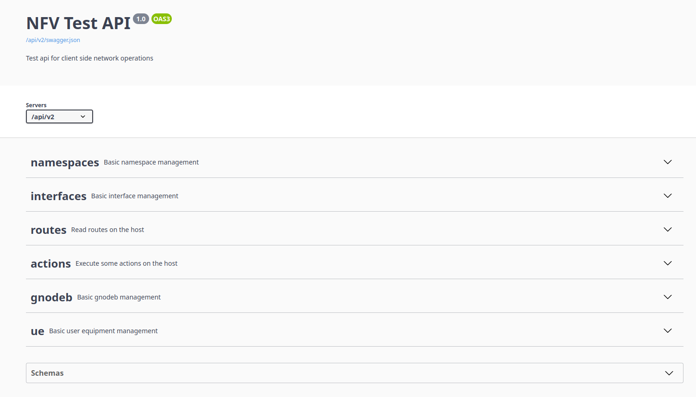

# Improve the automation

So far, the automation only deploys a very explicit configuration, it still involves some manual work and is very static.  If the infra change (i.e. we add one more router), we need to update the model manually accordingly.  Let's see what we can do to avoid that.

The file [flex_network.cf](./flex_network.cf) will deploy exactly the same model as before, but with two big advantages:
1. The model is smaller
2. The model is more dynamic

Instead of hard-coding the topology in our model, we actually load the topology from the [topology.yml](./inmanta-module-srlinux-helper//files/topology.yml) file, extract all the relevant information (routers and interfaces), and emit the corresponding configuration.

We can do this thanks to [plugins](https://docs.inmanta.com/community/latest/language.html#plug-ins) and [for loops](https://docs.inmanta.com/community/latest/language.html#for-loop).  Take some time to explore the model and the plugins.

## Do it yourself

This model is becoming very nice, but there is still something we can not do: configuring subscribers.

Building a resource and a handler to configure such subscriber is out of the scope of this training, but you can already do the following:
1. Create a new module, in which we will mock, and later, implement, the interactions with the subscribers.
> :bulb: You can use the [inmanta module template](https://docs.inmanta.com/community/latest/model_developers/module_creation.html#create-a-new-source-module).
2. In this module, create a plugin, which similarly to `srlinux_helper::get_srlinux_interfaces`, loads all the subscriber interfaces and their addresses.
3. In this module, create an entity to represent a subscriber, and one to represent a subscriber interface, construct all those entities using the plugin.
4. For each interface, create an implementation which prints the command that should be entered on the device, to setup the link properly (similarly to what is printed out by the `srlinux_helper::get_srlinux_interfaces` plugin, you can push it further).
5. Come back later when you know how to build a handler and create your own subscriber interface resource!

## Final step

The final step of automation for this lab will be to automate the subscribers. They have a documented API that you can find at <http://{subscriber-ip}:8080/api/v2/docs>. This API allows us to modify the interfaces and routes of the subscribers.



An example module is shown in the [subscriber folder](./subscriber/). In particular, you can take a look at the [model](./subscriber/model/_init.cf) and the [handlers](./subscriber/inmanta_plugins/subscriber/__init__.py). There are several comments indicating the documentation reference.

To install it you can use

    ```console
    (env) $ pip install -e inmanta-module-subscriber
    ```

And run the file [full_flex_network.cf](./full_flex_network.cf).