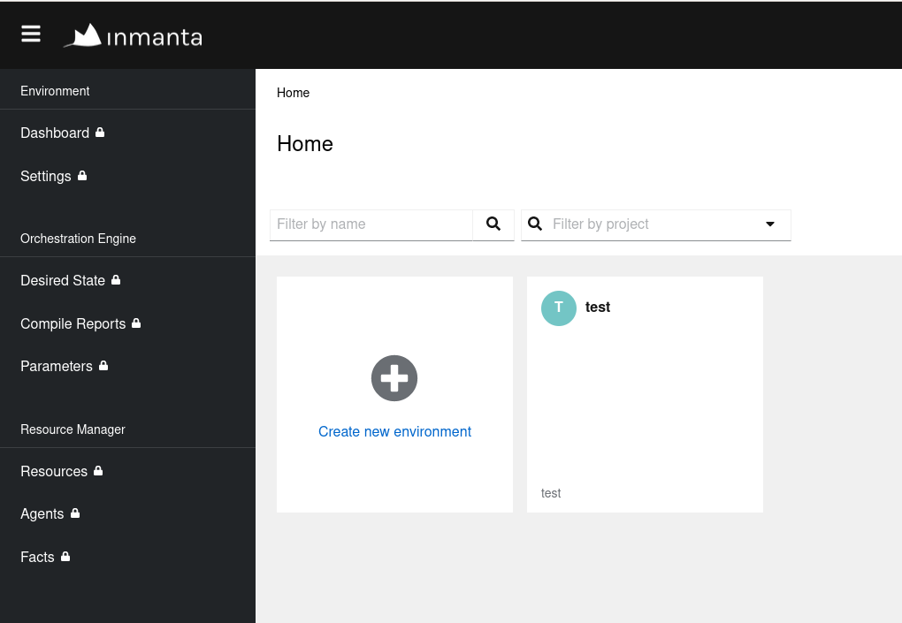

# Inmanta training

The goal of this training is multiple:
1. Discover clab as a development tool, to manage a development lab
2. Discover basics srlinux cli and linux's ip command
3. Assert basic networking knowledge, such as ip and ospf
4. Discover the inmanta orchestrator and use it to configure a network

In the training, we perform the same configuration (interface config and OSPF) with increasingly sophisticated automation. 
1. the lab is configured by hand. The goal is to learn how the lab works and what service we will automate.
2. the manual config is converted to an inmanta model. The goal is to learn the basic functions of the orchestrator
3. the model is refactored to form a blueprint/template. The goal is to learn how to model a config to make re-usable building blocks.
4. the model is exposed via an api. The goal is to lear the basics of Lifecycle and Service Management

## Modules

The lab consist of different modules. Some modules are different between Open Source version of the orchestrator (OSS) and licensed version (ISO).
The final module (LSM) is only available for ISO. 
Use the table below for navigation.

| Module                  | Goal                                                        | Open Source | Licensed | Depends on              |
|-------------------------|-------------------------------------------------------------|-------------|----------|-------------------------|
| Clab                    | Set up a containerized lab for the rest of the training     | [Open Source setup](lab/README.md)            |   [Licenses Setup](isolab/README.md)        |                         |
| Srlinux Basics          | Manually configure the lab                                  | [Manual Configuration](0-manual-configuration.md) | [Manual Configuration](0-manual-configuration.md) | clab                    |
| Convert to model        | Automatically convert the device config to an inmanta model | -           |          | clab                    |
| Basic Inmanta Model     | A flat configuration model                                  |             |          | clab                    |
| Templating and modeling | Refactor the model to have common components                |             |          | Basic Inmanta Model     |
| LSM                     | Expose the functionality via an API                         | -           |          | Templating and modeling |


## Discovering clab

**Prerequisites**
1.  [Install Docker](https://docs.docker.com/get-docker/).
2.  [Install Containerlab](https://containerlab.dev/install/).

In the [lab](lab/) folder, you can find a [topology file](lab/topology.yml), defining the hosts and link we will deploy with containerlab.  You can refer to the [README](lab/README.md) in the lab folder to deploy and explore the lab.  It is a nice exercise to configure the lab manually, the configs for the srlinux routers and the subscribers can be found in the lab folder as well.

The next steps assume that you have deployed the lab successfully.


## Discovering the orchestrator

1. Create a virtual environment and install inmanta in it
    ```console
    $ python3 -m venv env
    $ source env/bin/activate
    (env) $ pip install setuptools inmanta
    ...
    (env) $ inmanta --version
    Inmanta Service Orchestrator (Open Source Edition): 2023.4
    Compiler version: 2024.0
    Extensions:
        * core: 10.0.0
    ```

2. Use inmanta-cli to create a project and an environment on the running orchestrator.  Mind the importance of the `--save` option, it will create an `.inmanta` file in our current directory, saving the reference to the environment we just created, for all the later interaction with the orchestrator, the file will be automatically picked up, we won't need to specify the host, port or environment anymore.
    ```console
    (env) $ inmanta-cli --host 172.30.0.3 --port 8888 project create --name test
    (env) $ inmanta-cli --host 172.30.0.3 --port 8888 environment create --project test --name test --save
    ```

3. Open your browser at the following url to see the inmanta web console, you should see there the environment you just created: http://172.30.0.3:8888/console
    

4. Navigate the different pages by clicking around, nothing is happening there yet, we still have to tell the orchestrator what it should do.


> **Next:**
> - [Configure the network manually](./0-manual-configuration.md)
> - [Configure the network with Inmanta](./1-basic-deployment.md)
> - [Discover the power of Inmanta's DSL](./2-getting-further.md)
