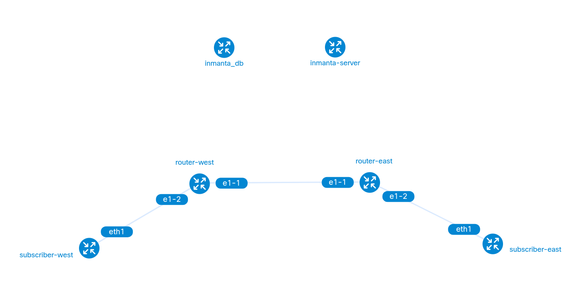

# Srlinux lab

The topology file in this folder will deploy the following:
- An inmanta orchestrator together with a database
- Two routers (srlinux)
- Two subscribers (nfv-test-api), basic containers containing some nice networking tools

The diagram below shows the desired ip plan we will configure.  When deploying the lab with containerlab, only the management network will be configured.


## Start the lab
```console
$ sudo clab deploy --topo topology.yml
INFO[0000] Containerlab v0.44.3 started                 
INFO[0000] Parsing & checking topology file: topology.yml 
INFO[0000] Creating docker network: Name="clab", IPv4Subnet="172.30.0.0/16", IPv6Subnet="", MTU="1500" 
INFO[0000] Creating lab directory: /home/guillaume/Documents/solutions-training/srlinux-quickstart/containerlab/clab-srlinux 
WARN[0000] SSH_AUTH_SOCK not set, skipping pubkey fetching 
INFO[0000] Creating container: "inmanta_db"             
INFO[0000] Creating container: "subscriber-west"        
INFO[0000] Creating container: "inmanta-server"         
INFO[0000] Creating container: "subscriber-east"        
INFO[0000] Creating container: "router-east"            
INFO[0000] Creating container: "router-west"            
INFO[0000] Creating link: router-east:e1-2 <--> subscriber-east:eth1 
INFO[0001] Creating link: router-east:e1-1 <--> router-west:e1-1 
INFO[0001] Creating link: router-west:e1-2 <--> subscriber-west:eth1 
INFO[0001] Running postdeploy actions for Nokia SR Linux 'router-east' node 
INFO[0001] Running postdeploy actions for Nokia SR Linux 'router-west' node 
INFO[0007] Adding containerlab host entries to /etc/hosts file 
INFO[0007] 🎉 New containerlab version 0.48.6 is available! Release notes: https://containerlab.dev/rn/0.48/#0486
Run 'containerlab version upgrade' to upgrade or go check other installation options at https://containerlab.dev/install/ 
+---+------------------------------+--------------+-------------------------------------+-------+---------+---------------+--------------+
| # |             Name             | Container ID |                Image                | Kind  |  State  | IPv4 Address  | IPv6 Address |
+---+------------------------------+--------------+-------------------------------------+-------+---------+---------------+--------------+
| 1 | clab-srlinux-inmanta-server  | 3aabc1b9d5af | ghcr.io/inmanta/orchestrator:latest | linux | running | 172.30.0.3/16 | N/A          |
| 2 | clab-srlinux-inmanta_db      | b63e9e1a2bbd | postgres:13                         | linux | running | 172.30.0.2/16 | N/A          |
| 3 | clab-srlinux-router-east     | 5690f7a3f7c5 | ghcr.io/nokia/srlinux               | srl   | running | 172.30.0.4/16 | N/A          |
| 4 | clab-srlinux-router-west     | 33557503e3b8 | ghcr.io/nokia/srlinux               | srl   | running | 172.30.0.5/16 | N/A          |
| 5 | clab-srlinux-subscriber-east | 104abe78d534 | inmantaci/nfv-test-api:latest       | linux | running | 172.30.0.6/16 | N/A          |
| 6 | clab-srlinux-subscriber-west | 1c2a8705bb6d | inmantaci/nfv-test-api:latest       | linux | running | 172.30.0.7/16 | N/A          |
+---+------------------------------+--------------+-------------------------------------+-------+---------+---------------+--------------+
```

## Visualize the topology
```console
$ sudo clab graph --topo topology.yml 
INFO[0000] Parsing & checking topology file: topology.yml 
INFO[0000] Serving static files from directory: /etc/containerlab/templates/graph/nextui/static 
INFO[0000] Serving topology graph on http://0.0.0.0:50080

```


## Check the mgmt ips
```console
$ sudo clab inspect --topo topology.yml 
INFO[0000] Parsing & checking topology file: topology.yml 
+---+------------------------------+--------------+-------------------------------------+-------+---------+---------------+--------------+
| # |             Name             | Container ID |                Image                | Kind  |  State  | IPv4 Address  | IPv6 Address |
+---+------------------------------+--------------+-------------------------------------+-------+---------+---------------+--------------+
| 1 | clab-srlinux-inmanta-server  | 3aabc1b9d5af | ghcr.io/inmanta/orchestrator:latest | linux | running | 172.30.0.3/16 | N/A          |
| 2 | clab-srlinux-inmanta_db      | b63e9e1a2bbd | postgres:13                         | linux | running | 172.30.0.2/16 | N/A          |
| 3 | clab-srlinux-router-east     | 5690f7a3f7c5 | ghcr.io/nokia/srlinux               | srl   | running | 172.30.0.4/16 | N/A          |
| 4 | clab-srlinux-router-west     | 33557503e3b8 | ghcr.io/nokia/srlinux               | srl   | running | 172.30.0.5/16 | N/A          |
| 5 | clab-srlinux-subscriber-east | 104abe78d534 | inmantaci/nfv-test-api:latest       | linux | running | 172.30.0.6/16 | N/A          |
| 6 | clab-srlinux-subscriber-west | 1c2a8705bb6d | inmantaci/nfv-test-api:latest       | linux | running | 172.30.0.7/16 | N/A          |
+---+------------------------------+--------------+-------------------------------------+-------+---------+---------------+--------------+
```

## Accessing the routers
```console
$ ssh admin@clab-srlinux-router-east 
Warning: Permanently added 'clab-srlinux-router-east' (ED25519) to the list of known hosts.
................................................................
:                  Welcome to Nokia SR Linux!                  :
:              Open Network OS for the NetOps era.             :
:                                                              :
:    This is a freely distributed official container image.    :
:                      Use it - Share it                       :
:                                                              :
: Get started: https://learn.srlinux.dev                       :
: Container:   https://go.srlinux.dev/container-image          :
: Docs:        https://doc.srlinux.dev/23-10                   :
: Rel. notes:  https://doc.srlinux.dev/rn23-10-1               :
: YANG:        https://yang.srlinux.dev/v23.10.1               :
: Discord:     https://go.srlinux.dev/discord                  :
: Contact:     https://go.srlinux.dev/contact-sales            :
................................................................

Using configuration file(s): []
Welcome to the srlinux CLI.
Type 'help' (and press <ENTER>) if you need any help using this.
--{ running }--[  ]--
A:router-east#
```

> :bulb: If you are prompted for a password, find the default user and password in the documentation of containerlab: https://containerlab.dev/manual/kinds/srl/

## Accessing the subscribers
```console
$ docker exec -ti clab-srlinux-subscriber-east bash
(app-root) bash-4.4# 
```

## Destroy the lab
```
$ sudo clab destroy --topo topology.yml 
INFO[0000] Parsing & checking topology file: topology.yml 
INFO[0000] Destroying lab: srlinux                      
INFO[0000] Removed container: clab-srlinux-subscriber-east 
INFO[0000] Removed container: clab-srlinux-router-east  
INFO[0000] Removed container: clab-srlinux-router-west  
INFO[0000] Removed container: clab-srlinux-subscriber-west 
INFO[0000] Removed container: clab-srlinux-inmanta-server 
INFO[0000] Removed container: clab-srlinux-inmanta_db   
INFO[0000] Removing containerlab host entries from /etc/hosts file
```
The data directory of the PostgreSQL database is mapped to the host. This way no data is lost when the PostgreSQL container restart. Remove the `pgdata/pgdata` directory (`rm -rf pgdata/pgdata`) to remove the PostgreSQL data as well.

