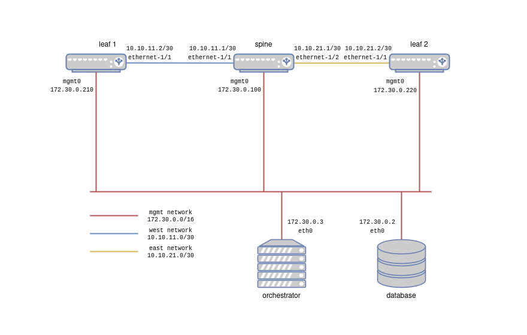

# Srlinux lab setup (Open Source)

The topology file in this folder will deploy the following:
- An inmanta orchestrator together with a database
- Two routers (srlinux)
- Two subscribers (nfv-test-api), basic containers containing some nice networking tools

The diagram below shows the desired ip plan we will configure.  When deploying the lab with containerlab, only the management network will be configured.



## Install clab 

Follow the instuctions in the [containerlab install guide](https://containerlab.dev/install/). 

## Clone this repo

```console
git clone git@github.com:inmanta/examples.git
cd examples/Training/lab
```

## Start the lab
```console
$sudo clab deploy --topo topology.yml 
14:13:29 INFO Containerlab started version=0.66.0
14:13:29 INFO Parsing & checking topology file=topology.yml
14:13:29 INFO Creating docker network name=clab IPv4 subnet=172.30.0.0/16 IPv6 subnet="" MTU=1500
14:13:29 INFO Creating lab directory path=/home/wouter/projects/examples/Training/lab/clab-srlinux
14:13:29 INFO Creating container name=inmanta_db
14:13:29 INFO Creating container name=leaf2
14:13:29 INFO Creating container name=inmanta-server
14:13:29 INFO Creating container name=leaf1
14:13:29 INFO Creating container name=spine
14:13:30 INFO Running postdeploy actions kind=srl node=leaf1
14:13:30 INFO Created link: spine:e1-1 ▪┄┄▪ leaf1:e1-1
14:13:30 INFO Running postdeploy actions kind=srl node=leaf2
14:13:30 INFO Created link: spine:e1-2 ▪┄┄▪ leaf2:e1-1
14:13:30 INFO Running postdeploy actions kind=srl node=spine
14:13:47 INFO Adding host entries path=/etc/hosts
14:13:47 INFO Adding SSH config for nodes path=/etc/ssh/ssh_config.d/clab-srlinux.conf
╭─────────────────────────────┬─────────────────────────────────────┬─────────┬────────────────╮
│             Name            │              Kind/Image             │  State  │ IPv4/6 Address │
├─────────────────────────────┼─────────────────────────────────────┼─────────┼────────────────┤
│ clab-srlinux-inmanta-server │ linux                               │ running │ 172.30.0.3     │
│                             │ ghcr.io/inmanta/orchestrator:latest │         │ N/A            │
├─────────────────────────────┼─────────────────────────────────────┼─────────┼────────────────┤
│ clab-srlinux-inmanta_db     │ linux                               │ running │ 172.30.0.2     │
│                             │ postgres:16                         │         │ N/A            │
├─────────────────────────────┼─────────────────────────────────────┼─────────┼────────────────┤
│ clab-srlinux-leaf1          │ srl                                 │ running │ 172.30.0.210   │
│                             │ ghcr.io/nokia/srlinux               │         │ N/A            │
├─────────────────────────────┼─────────────────────────────────────┼─────────┼────────────────┤
│ clab-srlinux-leaf2          │ srl                                 │ running │ 172.30.0.220   │
│                             │ ghcr.io/nokia/srlinux               │         │ N/A            │
├─────────────────────────────┼─────────────────────────────────────┼─────────┼────────────────┤
│ clab-srlinux-spine          │ srl                                 │ running │ 172.30.0.100   │
│                             │ ghcr.io/nokia/srlinux               │         │ N/A            │
╰─────────────────────────────┴─────────────────────────────────────┴─────────┴────────────────╯
```

## Visualize the topology
```console
$ sudo clab graph --topo topology.yml 
INFO[0000] Parsing & checking topology file: topology.yml 
INFO[0000] Serving static files from directory: /etc/containerlab/templates/graph/nextui/static 
INFO[0000] Serving topology graph on http://0.0.0.0:50080

```


## Check the mgmt ips
```console
$ sudo clab inspect --topo topology.yml 
INFO[0000] Parsing & checking topology file: topology.yml 
14:18:24 INFO Parsing & checking topology file=topology.yml
╭─────────────────────────────┬─────────────────────────────────────┬─────────┬────────────────╮
│             Name            │              Kind/Image             │  State  │ IPv4/6 Address │
├─────────────────────────────┼─────────────────────────────────────┼─────────┼────────────────┤
│ clab-srlinux-inmanta-server │ linux                               │ running │ 172.30.0.3     │
│                             │ ghcr.io/inmanta/orchestrator:latest │         │ N/A            │
├─────────────────────────────┼─────────────────────────────────────┼─────────┼────────────────┤
│ clab-srlinux-inmanta_db     │ linux                               │ running │ 172.30.0.2     │
│                             │ postgres:16                         │         │ N/A            │
├─────────────────────────────┼─────────────────────────────────────┼─────────┼────────────────┤
│ clab-srlinux-leaf1          │ srl                                 │ running │ 172.30.0.210   │
│                             │ ghcr.io/nokia/srlinux               │         │ N/A            │
├─────────────────────────────┼─────────────────────────────────────┼─────────┼────────────────┤
│ clab-srlinux-leaf2          │ srl                                 │ running │ 172.30.0.220   │
│                             │ ghcr.io/nokia/srlinux               │         │ N/A            │
├─────────────────────────────┼─────────────────────────────────────┼─────────┼────────────────┤
│ clab-srlinux-spine          │ srl                                 │ running │ 172.30.0.100   │
│                             │ ghcr.io/nokia/srlinux               │         │ N/A            │
╰─────────────────────────────┴─────────────────────────────────────┴─────────┴────────────────╯
```

## Accessing the routers
```console
$ ssh admin@ clab-srlinux-leaf1
Warning: Permanently added 'clab-srlinux-spine' (ED25519) to the list of known hosts.
................................................................
:                  Welcome to Nokia SR Linux!                  :
:              Open Network OS for the NetOps era.             :
:                                                              :
:    This is a freely distributed official container image.    :
:                      Use it - Share it                       :
:                                                              :
: Get started: https://learn.srlinux.dev                       :
: Container:   https://go.srlinux.dev/container-image          :
: Docs:        https://doc.srlinux.dev/25-3                    :
: Rel. notes:  https://doc.srlinux.dev/rn25-3-2                :
: YANG:        https://yang.srlinux.dev/v25.3.2                :
: Discord:     https://go.srlinux.dev/discord                  :
: Contact:     https://go.srlinux.dev/contact-sales            :
................................................................

Loading environment configuration file(s): ['/home/admin/.srlinuxrc']
Welcome to the Nokia SR Linux CLI.


--{ running }--[  ]--
A:admin@spine#
```

> :bulb: If you are prompted for a password, find the default user and password in the documentation of containerlab: https://containerlab.dev/manual/kinds/srl/


## Destroy the lab
```
$ sudo clab destroy --topo topology.yml 
INFO[0000] Parsing & checking topology file: topology.yml 
INFO[0000] Destroying lab: srlinux                      
INFO[0000] Removed container: clab-srlinux-subscriber-east 
INFO[0000] Removed container: clab-srlinux-router-east  
INFO[0000] Removed container: clab-srlinux-router-west  
INFO[0000] Removed container: clab-srlinux-subscriber-west 
INFO[0000] Removed container: clab-srlinux-inmanta-server 
INFO[0000] Removed container: clab-srlinux-inmanta_db   
INFO[0000] Removing containerlab host entries from /etc/hosts file
```
The data directory of the PostgreSQL database is mapped to the host. This way no data is lost when the PostgreSQL container restart. Remove the `pgdata/pgdata` directory (`rm -rf pgdata/pgdata`) to remove the PostgreSQL data as well.

