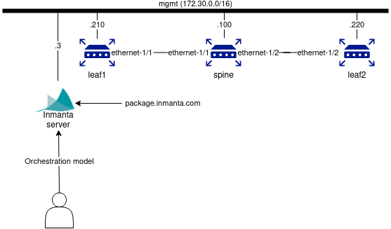
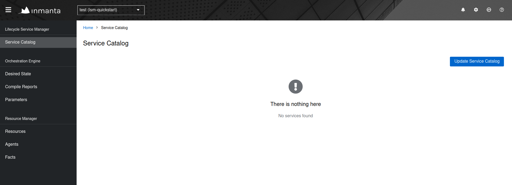
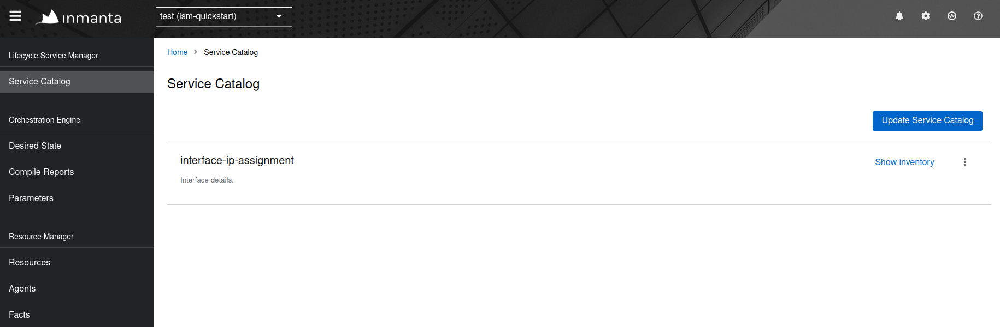
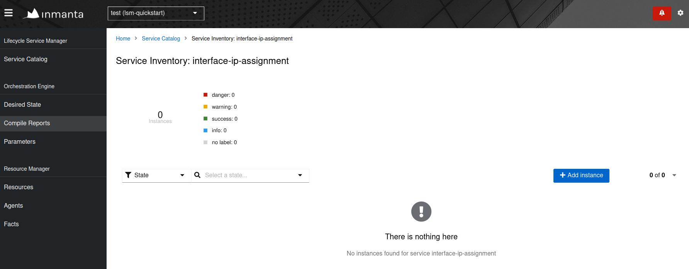
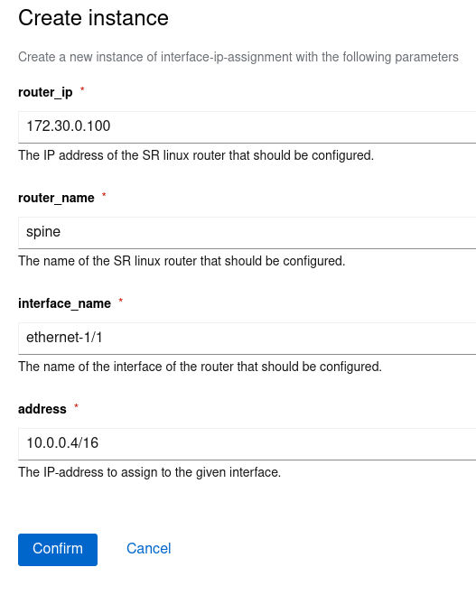

LSM quickstart
==============

This document provides a quickstart for the Inmanta lifecycle service
manager (LSM). A high-level overview will be given on how Inmanta LSM
can be used to model and provision new services within a certain
infrastructure. This quickstart considers a basic service, which creates
and updates the IP of a given interface.

Overview setup
--------------

The figure shown below, gives an overview of the infrastructure required
to execute this quickstart. The infrastructure consists of:

1.  An Inmanta Service Orchestrator with LSM
2.  Three SR Linux routers (spine, leaf1, leaf2)
3.  An internet connection



The SR Linux routers in this guide are setup as a 3-node CLOS network
with a spine and two leaf switches. `mgmt` is the management interface
of the SR Linux routers and the Inmanta Service Orchestrator making them
reachable over the management network (172.30.0.0/24).

The service modelled in the following section manages the association of
IP-addresses to any interface of the SR Linux routers.

Prerequisites
-------------

This guide assumes that you already finished the
[quickstart](https://docs.inmanta.com/inmanta-service-orchestrator/latest/quickstart.html). so if you
haven\'t followed that one, please start with it.

**Make sure that you have the necessary license information**, namely:

-   Credentials to the package repository;
-   Entitlement file;
-   License file.

**Python version 3.9 needs to be installed on your machine.**

1.  [Install Docker](https://docs.docker.com/get-docker/).

2.  [Install Containerlab](https://containerlab.dev/install/).

3.  Prepare a development environment by creating a python virtual environment and installing Inmanta:

``` {.}
$ mkdir -p ~/.virtualenvs
$ python3 -m venv ~/.virtualenvs/lsm-srlinux
$ source ~/.virtualenvs/lsm-srlinux/bin/activate
$ pip install inmanta
```

4.  Change directory to the LSM SR Linux example:

``` {.}
$ cd examples/lsm-srlinux
```

This folder contains a project.yml, which looks like this:

``` {.}
name: LSM SR Linux Example
description: Provides and example of a LSM use case with SR Linux.
author: Inmanta
author_email: code@inmanta.com
license: ASL 2.0
copyright: 2022 Inmanta
modulepath: libs
downloadpath: libs
repo:
- type: package
    url: https://packages.inmanta.com/<token>/inmanta-service-orchestrator-6-stable/python/simple/
install_mode: release
requires:
```

> **_NOTE:_**
Additional explanation of each field can be found on the [quickstart](https://docs.inmanta.com/inmanta-service-orchestrator/latest/quickstart.html).


5.  Change the \<token\> in the repo url to the credentials to the package repository (see Prerequisites section).
6.  Go to the `containerlab` directory.

``` {.}
$ cd containerlab
```

7.  Create a folder called `resources` on the `containerlab` folder and
    place your license and entitlement files there. The names of the
    files have to be `com.inmanta.jwe` for the entitlement file and
    `com.inmanta.license` for the license file.
8.  [Spin-up the containers](https://docs.inmanta.com/inmanta-service-orchestrator/latest/quickstart.html#setting-up-the-lab)

``` {.}
$ sudo clab deploy -t topology.yml
```

> **_NOTE:_**
Additional information about this command and how to connect to these
containers can be found on the
[quickstart](https://docs.inmanta.com/inmanta-service-orchestrator/latest/quickstart.html#connecting-to-the-containers).

Orchestration model
-------------------

The full orchestration model to assign an IP-address to an interface of
a SR Linux router, is shown below.

``` {.inmanta}
import nokia_srlinux
import nokia_srlinux::interface as srinterface
import nokia_srlinux::interface::subinterface as srsubinterface
import nokia_srlinux::interface::subinterface::ipv4 as sripv4
import yang
import lsm
import lsm::fsm

entity InterfaceIPAssignment extends lsm::ServiceEntity:
    """
        Interface details.

        :attr router_ip: The IP address of the SR linux router that should be configured.
        :attr router_name: The name of the SR linux router that should be configured.
        :attr interface_name: The name of the interface of the router that should be configured.
        :attr address: The IP-address to assign to the given interface.
    """

    std::ipv_any_address router_ip
    string router_name
    string interface_name

    std::ipv_any_interface address
    lsm::attribute_modifier address__modifier="rw+"

end

implement InterfaceIPAssignment using parents, interfaceIPAssignment

implementation interfaceIPAssignment for InterfaceIPAssignment:

    device = nokia_srlinux::GnmiDevice(
            auto_agent = true,
            name = self.router_name,
            mgmt_ip = self.router_ip,
            yang_credentials = yang::Credentials(
                username = "admin",
                password = "admin"
            )
        )

    resource = nokia_srlinux::Resource(
        device=device,
        identifier = self.instance_id
    )

    self.resources += resource.yang_resource

    interface = nokia_srlinux::Interface(
        device = device,
        name = self.interface_name,
        resource = resource,
        mtu = 9000,
        subinterface = srinterface::Subinterface(
             x_index = 0,
             ipv4=srsubinterface::Ipv4(
                 address = sripv4::Address(
                     ip_prefix = self.address
                  ),
             ),
         ),
         comanaged = false
    )

end


binding = lsm::ServiceEntityBinding(
    service_entity="__config__::InterfaceIPAssignment",
    lifecycle=lsm::fsm::simple,
    service_entity_name="interface-ip-assignment",
)


for assignment in lsm::all(binding):
    InterfaceIPAssignment(
        instance_id=assignment["id"],
        router_ip=assignment["attributes"]["router_ip"],
        router_name=assignment["attributes"]["router_name"],
        interface_name=assignment["attributes"]["interface_name"],
        address=assignment["attributes"]["address"],
        entity_binding=binding,
    )
end
```

-   Lines 1 to 7 import several modules required by this configuration
    model.
-   Lines 9 to 26 define the API of the new service, i.e. the attributes
    required to instantiate a new instance of the service. The
    `InterfaceIPAssignment` entity defines four attributes: `router_ip`,
    `router_name`, `interface_name` and `address`. Each attribute has a
    description defined in the docstring above. The docstring provides
    documentation on the meaning of a specific service attribute. The
    \"\<attribute\>\_\_modifier\" fields are meta-data fields. They
    defines whether the attribute can be modified or not. In the
    above-mentioned orchestration model, the `router_ip`, `router_name`
    and the `interface_name` attribute can only be set upon instantiation
    of the model, while the address attribute can be changed during the
    lifetime of the service. More information on attribute modifiers can
    be found
    [here](https://docs.inmanta.com/inmanta-service-orchestrator/latest/moduleguides/lsm/attributes_metadata/attributes_metadata.html#attribute-modifier).
-   Line 28 defines which implementation should be used to instantiate
    the `InterfaceIPAssignment` service entity.
-   Lines 30 to 65 provide the actual implementation for the
    `InterfaceIPAssignment` service entity. If an instance is created of
    the `InterfaceIPAssignment` service entity, this implementation will
    make sure that the `address` specified in the attributes of the
    service instance, will be configured on the requested interface and
    SR Linux router.
-   Lines 42 to 47 in particular, are where the resource is instantiated
    and assigned to the `resources` field. The `resources` field should
    contain the list of resources that need to be deployed before the
    state of the instance can be moved from *creating* to *up*.
-   Lines 68 to 72 create a service entity binding. It associates a name
    and a lifecycle to the `InterfaceIPAssignment` service entity and
    registers it in the Inmanta Service Orchestrator via its northbound
    API. More information on service lifecycles can be found
    [here](https://docs.inmanta.com/inmanta-service-orchestrator/latest/moduleguides/lsm/lifecycle/lifecycle.html).
-   Lines 75 to 83 create an instance of the `InterfaceIPAssignment`
    entity for each service instance. The `lsm::all()` plugin retrieves
    all the service instances via the Inmanta Service Orchestrator API.

Install the orchestration model onto the Inmanta server
-------------------------------------------------------

Go back to the previous folder and
[create an Inmanta project and environment](https://docs.inmanta.com/inmanta-service-orchestrator/latest/quickstart.html#create-an-inmanta-project-and-an-environment).

```{-}
# Create a project called test
$ inmanta-cli --host 172.30.0.3 project create -n test
# Create an environment called lsm-srlinux
$ inmanta-cli --host 172.30.0.3 environment create -p test -n lsm-srlinux --save
```

The following command executes a script to copy the required resources
to a specific folder inside the container.

``` {.}
$ docker exec -ti -w /code clab-srlinux-inmanta-server  /code/setup.sh
```

Afterwards, open the web-console, in this example it is on
<http://172.30.0.3:8888/console/>.



Click on the `Update Service Catalog` button. This will make the new
`interface-ip-assignment` service known by the Inmanta orchestrator,
making it possible to create new instances of this service via the LSM
API or via the Inmanta web-console.

Clicking on the button will:

-   Download all required code onto the orchestrator;
-   Install the project;
-   Export the service entity bindings to the service catalog.

After executing these commands, the `interface-ip-assignment` service
will appear in the service catalog of the Inmanta web-console as shown
in the figure below.



Check that the router is empty
------------------------------

Login into the SR Linux router named \"spine\" using the username
\"admin\" and password \"admin\".

``` {.}
$ ssh admin@clab-srlinux-spine
```

> **_NOTE:_**
Additional information on how to connect to these containers can be
found on the
[quickstart](https://docs.inmanta.com/inmanta-service-orchestrator/latest/moduleguides/lsm/attributes_metadata/attributes_metadata.html#attribute-modifier). In this guide we will only do certain commands to show the
changes.

Check the interface configuration via the following command.

``` {.}
A:spine# list interface
    interface ethernet-1/1 {
    }
    interface ethernet-1/2 {
    }
    interface mgmt0 {
        subinterface 0 {
            ipv4 {
                dhcp-client {
                }
            }
            ipv6 {
                dhcp-client {
                }
            }
        }
    }
```

Create a new service instance
-----------------------------

Now, we will provision a new instance of the interface-ip-assignment
service via the Inmanta web-console. Click on the *Show inventory*
button after the vlan-assignment service and click on the *Add instance*
button.



Fill in the required attributes and click on confirm.



The service will be deployed automatically after clicking the *confirm*
button. During the deployment, the service instance will move through
different states of its lifecycle: start -\> acknowledged -\> creating
-\> up. When the service is in the up state, the interface is configured
successfully. Verify the configuration on the SR Linux \"spine\" router.

``` {.}
A:spine# list interface
    interface ethernet-1/1 {
        subinterface 0 {
            ipv4 {
                address 10.0.0.4/16 {
                }
            }
        }
    }
    interface ethernet-1/2 {
    }
    interface mgmt0 {
        subinterface 0 {
            ipv4 {
                dhcp-client {
                }
            }
            ipv6 {
                dhcp-client {
                }
            }
        }
    }
```
