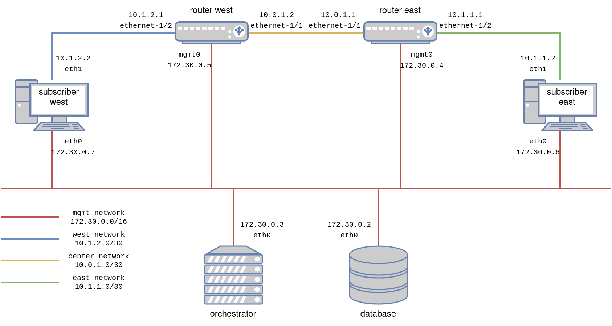

# Manual configuration

Let's see how to configure our lab manually.

For srlinux cli documentation, see https://documentation.nokia.com/srlinux/SR_Linux_HTML_R21-11/SysMgmt_Guide/cli-interface.html

## Configure the network manually - Routers

1. Enter configuration mode.  Srlinux calls this the `candidate` configuration, in which we can safely make any change of configuration without impacting the router, then apply them all at once, in a single transaction.
    ```console
    --{ running }--[  ]--
    A:router-east# enter candidate private
    --{ candidate private private-admin }--[  ]--
    A:router-east#
    ```

2. Configure an interface manually.  We will not enter in the details of how the cli works, srlinux has a lot of great documentation available online for this.  Let's just enter the desired configuration change manually.  This will configure the interface on router-east, which is connected to router-west.  We also add the interface to a network instance (~vrf) we create, and name `default`.  All the network configuration we will deploy on our routers will go into this network instance.
    ```console
    --{ candidate private private-admin }--[  ]--
    A:router-east# set / interface ethernet-1/1
    set / interface ethernet-1/1 admin-state enable
    set / interface ethernet-1/1 subinterface 0
    set / interface ethernet-1/1 subinterface 0 admin-state enable
    set / interface ethernet-1/1 subinterface 0 ipv4
    set / interface ethernet-1/1 subinterface 0 ipv4 admin-state enable
    set / interface ethernet-1/1 subinterface 0 ipv4 address 10.0.1.1/30
    set / network-instance default
    set / network-instance default admin-state enable
    set / network-instance default interface ethernet-1/1.0
    set / network-instance default protocols
    set / network-instance default protocols linux
    set / network-instance default protocols linux import-routes true
    set / network-instance default protocols linux export-routes true
    --{ * candidate private private-admin }--[  ]--
    A:router-east#
    ```

3. Visualize the change you are about to push on the router.
    ```console
    --{ +* candidate private private-admin }--[  ]--
    A:router-east# diff
    +     interface ethernet-1/1 {
    +         subinterface 0 {
    +             admin-state enable
    +             ipv4 {
    +                 admin-state enable
    +                 address 10.0.1.1/30 {
    +                 }
    +             }
    +         }
    +     }
    +     network-instance default {
    +         admin-state enable
    +         interface ethernet-1/1.0 {
    +         }
    +         protocols {
    +             linux {
    +                 import-routes true
    +                 export-routes true
    +             }
    +         }
    +     }
    --{ +* candidate private private-admin }--[  ]--
    A:router-east#
    ```

4. Commit the change and exit configuration mode.  The configuration proposed above should be accepted without any issue.
    ```console
    --{ * candidate private private-admin }--[  ]--
    A:router-east# commit now
    All changes have been committed. Leaving candidate mode.
    --{ + running }--[  ]--
    A:router-east#
    ```

5. Check the status of the interface we just configured using the `show` command.
    ```console
    --{ + running }--[  ]--
    A:router-east# show interface ethernet-1/1.0
    ================================================================================
    ethernet-1/1.0 is up
        Network-instances:
        * Name: default
        Encapsulation   : null
        Type            : routed
        IPv4 addr    : 10.0.1.1/30 (static, preferred, primary)
    ================================================================================
    --{ + running }--[  ]--
    A:router-east#
    ```

6. Repeat for the three other interfaces, follow the ip plan presented in the topology here below:
    - router-east --> subscriber-east
    - router-west --> router-east
    - router-west --> subscriber-west

    

7. Test connectivity in between the routers.  For this we can simply use the ping command.  Pay attention to select the correct network instance! The one in which we configured our interfaces.
    ```
    --{ + running }--[  ]--
    A:router-east# ping network-instance default 10.0.1.2
    Using network instance default
    PING 10.0.1.2 (10.0.1.2) 56(84) bytes of data.
    64 bytes from 10.0.1.2: icmp_seq=1 ttl=64 time=61.9 ms
    64 bytes from 10.0.1.2: icmp_seq=2 ttl=64 time=3.33 ms
    ^CCommand execution aborted : 'ping network-instance default 10.0.1.2'
    --{ + running }--[  ]--
    A:router-east#
    ```

    If the ping doesn't go through, you probably missed something in the configuration of the interfaces. Try to figure out yourself what is wrong and enjoy the thought that you will learn to automate all of this very soon.


## Configure the network manually - Subscribers

1. Configure the interface manually.  The subscribers containers are simple linux hosts, as for most linux hosts, we can simply use the `ip` command.
    ```console
    (app-root) bash-4.4# ip a add 10.1.1.2/30 dev eth1
    (app-root) bash-4.4#
    ```

2. Repeat for subscriber west.

3. Test connectivity in between subscriber and router.  Let's use the `ping` command again, on the subscriber side this time.
    ```console
    (app-root) bash-4.4# ping 10.1.1.1
    PING 10.1.1.1 (10.1.1.1) 56(84) bytes of data.
    64 bytes from 10.1.1.1: icmp_seq=1 ttl=64 time=2.25 ms
    64 bytes from 10.1.1.1: icmp_seq=2 ttl=64 time=2.20 ms
    ^C
    --- 10.1.1.1 ping statistics ---
    2 packets transmitted, 2 received, 0% packet loss, time 1000ms
    rtt min/avg/max/mdev = 2.200/2.223/2.246/0.023 ms
    ```

## End-to-end connectivity - Configuring ospf

At the moment, we can not ping from one subscriber to the other, we still need to do two things for that:
1. Configure ospf (on the routers), so that routes towards each subscribers are advertized to each router.
    ```console
    --{ + running }--[  ]--
    A:router-east# enter candidate private
    --{ + candidate private private-admin }--[  ]--
    A:router-east# set / network-instance default protocols ospf
    set / network-instance default protocols ospf instance default
    set / network-instance default protocols ospf instance default admin-state enable
    set / network-instance default protocols ospf instance default version ospf-v2
    set / network-instance default protocols ospf instance default router-id 172.30.0.4
    set / network-instance default protocols ospf instance default area 1.1.1.1
    set / network-instance default protocols ospf instance default area 1.1.1.1 interface ethernet-1/1.0
    set / network-instance default protocols ospf instance default area 1.1.1.1 interface ethernet-1/1.0 interface-type broadcast
    set / network-instance default protocols ospf instance default area 1.1.1.1 interface ethernet-1/2.0
    set / network-instance default protocols ospf instance default area 1.1.1.1 interface ethernet-1/2.0 interface-type broadcast
    --{ +* candidate private private-admin }--[  ]--
    A:router-east# commit now
    All changes have been committed. Leaving candidate mode.
    --{ + running }--[  ]--
    ```

    > :bulb: A few notes about this configuration:
    > - We use ospf-v2 as our links are configured with ipv4 addresses, and ospf-v3 doesn't support that.
    > - We created one area, in which we include all our interfaces, the id of such area doesn't really mather as it is the only one we will ever configure.
    > - We used as router-id the same ip as the mgmt ip for our router.  We could have chosen anything as long as it stays unique amongst the routers we are configuring.

2. Configure a static route on each subscriber, to make it use the the link toward the router to reach the other subscriber.
    ```console
    (app-root) bash-4.4# ip route add 10.1.2.0/30 via 10.1.1.1 dev eth1
    (app-root) bash-4.4#
    ```

3. Test end-to-end connectivity by reaching one subscriber from the other, again, using `ping`.
    ```console
    (app-root) bash-4.4# ping 10.1.2.2
    PING 10.1.2.2 (10.1.2.2) 56(84) bytes of data.
    64 bytes from 10.1.2.2: icmp_seq=1 ttl=62 time=0.296 ms
    64 bytes from 10.1.2.2: icmp_seq=2 ttl=62 time=0.254 ms
    ^C
    --- 10.1.2.2 ping statistics ---
    2 packets transmitted, 2 received, 0% packet loss, time 1060ms
    rtt min/avg/max/mdev = 0.254/0.275/0.296/0.021 ms
    ```


> **Next:**
> - [Configure the network with Inmanta](./1-basic-deployment.md)
> - [Discover the power of Inmanta's DSL](./2-getting-further.md)
