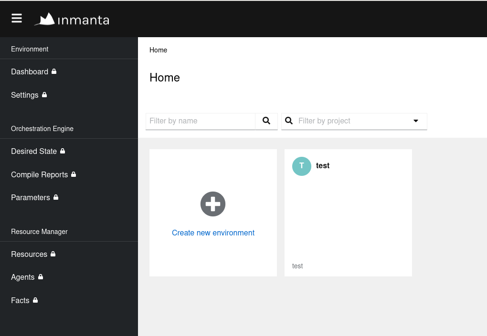
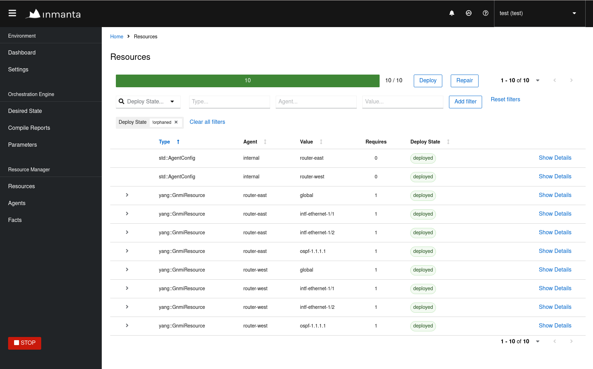

# Solutions training

The goal of this training is multiple:
1. Discover clab as a development tool, to manage a development lab
2. Discover basics srlinux cli and linux's ip command
3. Assert basic networking knowledge, such as ip and ospf
4. Discover the inmanta orchestrator and use it to configure a network


## Discovering clab

**Prerequisites**
1.  [Install Docker](https://docs.docker.com/get-docker/).
2.  [Install Containerlab](https://containerlab.dev/install/).

In the [lab](lab/) folder, you can find a [topology file](lab/topology.yml), defining the hosts and link we will deploy with containerlab.  You can refer to the [README](lab/README.md) in the lab folder to deploy and explore the lab.  It is a nice exercise to configure the lab manually, the configs for the srlinux routers and the subscribers can be found in the lab folder as well.

The next steps assume that you have deployed the lab successfully.


## Discovering the orchestrator

1. Create a virtual environment and install inmanta in it
    ```console
    $ python3 -m venv env
    $ source env/bin/activate
    (env) $ pip install setuptools inmanta
    ...
    (env) $ inmanta --version
    Inmanta Service Orchestrator (Open Source Edition): 2023.4
    Compiler version: 2024.0
    Extensions:
        * core: 10.0.0
    ```

2. Use inmanta-cli to create a project and an environment on the running orchestrator.  Mind the importance of the `--save` option, it will create an `.inmanta` file in our current directory, saving the reference to the environment we just created, for all the later interaction with the orchestrator, the file will be automatically picked up, we won't need to specify the host, port or environment anymore.
    ```console
    (env) $ inmanta-cli --host 172.30.0.3 --port 8888 project create --name test
    (env) $ inmanta-cli --host 172.30.0.3 --port 8888 environment create --project test --name test --save
    ```

3. Open your browser at the following url to see the inmanta web console, you should see there the environment you just created: http://172.30.0.3:8888/console
    

4. Navigate the different pages by clicking around, nothing is happening there yet, we still have to tell the orchestrator what it should do.


## Configure the network with the orchestrator

To tell the orchestrator what to do, we need to create a desired state for it to apply.  We do this by creating a `project` (locally), which contains a `model` (you can see the top level of the model in the [main.cf](main.cf) file), `compiling` it, and `exporting` its `resources` to the orchestrator.  
For this training, the `project` already exists, this is the folder you are currently working one.  An inmanta `project` is recognized by the  [project.yml file](https://docs.inmanta.com/community/dev/reference/projectyml.html#project-yml) at its root.  

1. Install the project, and its dependencies.  Due to the specific setup of this project, you need to install the `srlinux_helper` module manually, as it is currently not released anywhere.
    ```console
    (env) $ pip install -e inmanta-module-srlinux-helper
    (env) $ inmanta project install
    ```

2. Compile the model of the project.  The compiler will verify that our model is correct, and can be serialized into resources which can later be sent to the orchestrator, as instruction of "what to do".
    ```console
    (env) $ inmanta compile -f configure_ospf.cf
    ```

3. Export the resources to the orchestrator, the exporter will take the output of the compiler and send it to the orchestrator.  For each resource it receives, the orchestrator will then have as mission to deploy them, ensuring their desired state is enforced.
    ```console
    (env) $ inmanta export -f configure_ospf.cf
    ```

4. Open the orchestrator resource view, and see all the elements of the desired state, being deployed.  Once again, click around to see what is happening.
    


## Test network connectivity

1. Configure the subscribers
2. Run ping from one subscriber to the other
