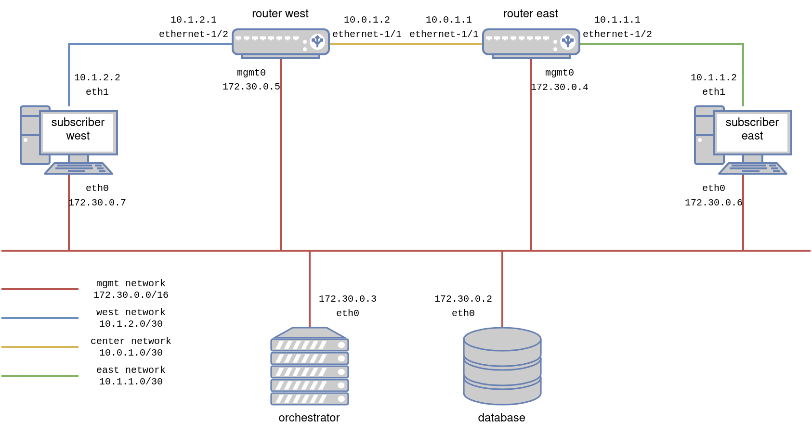

# Solutions training

The goal of this training is multiple:
1. Discover clab as a development tool, to manage a development lab
2. Discover basics srlinux cli and linux's ip command
3. Assert basic networking knowledge, such as ip and ospf
4. Discover the inmanta orchestrator and use it to configure a network


## Discovering clab

**Prerequisites**
1.  [Install Docker](https://docs.docker.com/get-docker/).
2.  [Install Containerlab](https://containerlab.dev/install/).

In the [lab](lab/) folder, you can find a [topology file](lab/topology.yml), defining the hosts and link we will deploy with containerlab.  You can refer to the [README](lab/README.md) in the lab folder to deploy and explore the lab.  It is a nice exercise to configure the lab manually, the configs for the srlinux routers and the subscribers can be found in the lab folder as well.

The next steps assume that you have deployed the lab successfully.


## Discovering the orchestrator

1. Create a virtual environment and install inmanta in it
    ```console
    $ python3 -m venv env
    $ source env/bin/activate
    (env) $ pip install setuptools inmanta
    ...
    (env) $ inmanta --version
    Inmanta Service Orchestrator (Open Source Edition): 2023.4
    Compiler version: 2024.0
    Extensions:
        * core: 10.0.0
    ```

2. Use inmanta-cli to create a project and an environment on the running orchestrator.  Mind the importance of the `--save` option, it will create an `.inmanta` file in our current directory, saving the reference to the environment we just created, for all the later interaction with the orchestrator, the file will be automatically picked up, we won't need to specify the host, port or environment anymore.
    ```console
    (env) $ inmanta-cli --host 172.30.0.3 --port 8888 project create --name test
    (env) $ inmanta-cli --host 172.30.0.3 --port 8888 environment create --project test --name test --save
    ```

3. Open your browser at the following url to see the inmanta web console, you should see there the environment you just created: http://172.30.0.3:8888/console
    

4. Navigate the different pages by clicking around, nothing is happening there yet, we still have to tell the orchestrator what it should do.


## Configure the network manually - Routers

1. Enter configuration mode.  Srlinux calls this the `candidate` configuration, in which we can safely make any change of configuration without impacting the router, then apply them all at once, in a single transaction.
    ```console
    --{ running }--[  ]--
    A:router-east# enter candidate private
    --{ candidate private private-admin }--[  ]--
    A:router-east#
    ```

2. Configure an interface manually.  We will not enter in the details of how the cli works, srlinux has a lot of great documentation available online for this.  Let's just enter the desired configuration change manually.  This will configure the interface on router-east, which is connected to router-west.  We also add the interface to a network instance (~vrf) we create, and name `default`.  All the network configuration we will deploy on our routers will go into this network instance.
    ```console
    --{ candidate private private-admin }--[  ]--
    A:router-east# set / interface ethernet-1/1
    set / interface ethernet-1/1 admin-state enable
    set / interface ethernet-1/1 subinterface 0
    set / interface ethernet-1/1 subinterface 0 admin-state enable
    set / interface ethernet-1/1 subinterface 0 ipv4
    set / interface ethernet-1/1 subinterface 0 ipv4 admin-state enable
    set / interface ethernet-1/1 subinterface 0 ipv4 address 10.0.1.1/30
    set / network-instance default
    set / network-instance default admin-state enable
    set / network-instance default interface ethernet-1/1.0
    set / network-instance default protocols
    set / network-instance default protocols linux
    set / network-instance default protocols linux import-routes true
    set / network-instance default protocols linux export-routes true
    --{ * candidate private private-admin }--[  ]--
    A:router-east#
    ```

3. Visualize the change you are about to push on the router.
    ```console
    --{ +* candidate private private-admin }--[  ]--
    A:router-east# diff
    +     interface ethernet-1/1 {
    +         subinterface 0 {
    +             admin-state enable
    +             ipv4 {
    +                 admin-state enable
    +                 address 10.0.1.1/30 {
    +                 }
    +             }
    +         }
    +     }
    +     network-instance default {
    +         admin-state enable
    +         interface ethernet-1/1.0 {
    +         }
    +         protocols {
    +             linux {
    +                 import-routes true
    +                 export-routes true
    +             }
    +         }
    +     }
    --{ +* candidate private private-admin }--[  ]--
    A:router-east#
    ```

4. Commit the change and exit configuration mode.  The configuration proposed above should be accepted without any issue.
    ```console
    --{ * candidate private private-admin }--[  ]--
    A:router-east# commit now
    All changes have been committed. Leaving candidate mode.
    --{ + running }--[  ]--
    A:router-east#
    ```

5. Check the status of the interface we just configured using the `show` command.
    ```console
    --{ + running }--[  ]--
    A:router-east# show interface ethernet-1/1.0
    ================================================================================
    ethernet-1/1.0 is up
        Network-instances:
        * Name: default
        Encapsulation   : null
        Type            : routed
        IPv4 addr    : 10.0.1.1/30 (static, preferred, primary)
    ================================================================================
    --{ + running }--[  ]--
    A:router-east#
    ```

6. Repeat for the three other interfaces, follow the ip plan presented in the topology here below:
    - router-east --> subscriber-east
    - router-west --> router-east
    - router-west --> subscriber-west

    

7. Test connectivity in between the routers.  For this we can simply use the ping command.  Pay attention to select the correct network instance! The one in which we configured our interfaces.
    ```
    --{ + running }--[  ]--
    A:router-east# ping network-instance default 10.0.1.2
    Using network instance default
    PING 10.0.1.2 (10.0.1.2) 56(84) bytes of data.
    64 bytes from 10.0.1.2: icmp_seq=1 ttl=64 time=61.9 ms
    64 bytes from 10.0.1.2: icmp_seq=2 ttl=64 time=3.33 ms
    ^CCommand execution aborted : 'ping network-instance default 10.0.1.2'
    --{ + running }--[  ]--
    A:router-east#
    ```

    If the ping doesn't go through, you probably missed something in the configuration of the interfaces. Try to figure out yourself what is wrong and enjoy the thought that you will learn to automate all of this very soon.


## Configure the network manually - Subscribers

1. Configure the interface manually.  The subscribers containers are simple linux hosts, as for most linux hosts, we can simply use the `ip` command.
    ```console
    (app-root) bash-4.4# ip a add 10.1.1.2/30 dev eth1
    (app-root) bash-4.4#
    ```

2. Repeat for subscriber west.

3. Test connectivity in between subscriber and router.  Let's use the `ping` command again, on the subscriber side this time.
    ```console
    (app-root) bash-4.4# ping 10.1.1.1
    PING 10.1.1.1 (10.1.1.1) 56(84) bytes of data.
    64 bytes from 10.1.1.1: icmp_seq=1 ttl=64 time=2.25 ms
    64 bytes from 10.1.1.1: icmp_seq=2 ttl=64 time=2.20 ms
    ^C
    --- 10.1.1.1 ping statistics ---
    2 packets transmitted, 2 received, 0% packet loss, time 1000ms
    rtt min/avg/max/mdev = 2.200/2.223/2.246/0.023 ms
    ```

## End-to-end connectivity - Configuring ospf

At the moment, we can not ping from one subscriber to the other, we still need to do two things for that:
1. Configure ospf (on the routers), so that routes towards each subscribers are advertized to each router.
    ```console
    --{ + running }--[  ]--
    A:router-east# enter candidate private
    --{ + candidate private private-admin }--[  ]--
    A:router-east# set / network-instance default protocols ospf
    set / network-instance default protocols ospf instance default
    set / network-instance default protocols ospf instance default admin-state enable
    set / network-instance default protocols ospf instance default version ospf-v2
    set / network-instance default protocols ospf instance default router-id 172.30.0.4
    set / network-instance default protocols ospf instance default area 1.1.1.1
    set / network-instance default protocols ospf instance default area 1.1.1.1 interface ethernet-1/1.0
    set / network-instance default protocols ospf instance default area 1.1.1.1 interface ethernet-1/1.0 interface-type broadcast
    set / network-instance default protocols ospf instance default area 1.1.1.1 interface ethernet-1/2.0
    set / network-instance default protocols ospf instance default area 1.1.1.1 interface ethernet-1/2.0 interface-type broadcast
    --{ +* candidate private private-admin }--[  ]--
    A:router-east# commit now
    All changes have been committed. Leaving candidate mode.
    --{ + running }--[  ]--
    ```

    > :bulb: A few notes about this configuration:
    > - We use ospf-v2 as our links are configured with ipv4 addresses, and ospf-v3 doesn't support that.
    > - We created one area, in which we include all our interfaces, the id of such area doesn't really mather as it is the only one we will ever configure.
    > - We used as router-id the same ip as the mgmt ip for our router.  We could have chosen anything as long as it stays unique amongst the routers we are configuring.

2. Configure a static route on each subscriber, to make it use the the link toward the router to reach the other subscriber.
    ```console
    (app-root) bash-4.4# ip route add 10.1.2.0/30 via 10.1.1.1 dev eth1
    (app-root) bash-4.4#
    ```

3. Test end-to-end connectivity by reaching one subscriber from the other, again, using `ping`.
    ```console
    (app-root) bash-4.4# ping 10.1.2.2
    PING 10.1.2.2 (10.1.2.2) 56(84) bytes of data.
    64 bytes from 10.1.2.2: icmp_seq=1 ttl=62 time=0.296 ms
    64 bytes from 10.1.2.2: icmp_seq=2 ttl=62 time=0.254 ms
    ^C
    --- 10.1.2.2 ping statistics ---
    2 packets transmitted, 2 received, 0% packet loss, time 1060ms
    rtt min/avg/max/mdev = 0.254/0.275/0.296/0.021 ms
    ```


## Configure the network with the orchestrator

To tell the orchestrator what to do, we need to create a desired state for it to apply.  We do this by creating a `project` (locally), which contains a `model` (you can see the top level of the model in the [main.cf](main.cf) file), `compiling` it, and `exporting` its `resources` to the orchestrator.  
For this training, the `project` already exists, this is the folder you are currently working one.  An inmanta `project` is recognized by the  [project.yml file](https://docs.inmanta.com/community/dev/reference/projectyml.html#project-yml) at its root.  

1. Install the project, and its dependencies.  Due to the specific setup of this project, you need to install the `srlinux_helper` module manually, as it is currently not released anywhere.
    ```console
    (env) $ pip install -e inmanta-module-srlinux-helper
    (env) $ inmanta project install
    ```

2. Compile the model of the project.  The compiler will verify that our model is correct, and can be serialized into resources which can later be sent to the orchestrator, as instruction of "what to do".
    ```console
    (env) $ inmanta compile -f configure_ospf.cf
    ```

3. Export the resources to the orchestrator, the exporter will take the output of the compiler and send it to the orchestrator.  For each resource it receives, the orchestrator will then have as mission to deploy them, ensuring their desired state is enforced.
    ```console
    (env) $ inmanta export -f configure_ospf.cf
    ```

4. Open the orchestrator resource view, and see all the elements of the desired state, being deployed.  Once again, click around to see what is happening.
    

5. (Optional) Investigating deployment issues.  If you didn't use exactly the same ip plan, or ospf area id or network instance name in the manual configuration as in the inmanta model, the orchestrator might struggle to push the configuration.  You would notice it as some resources would be marked as `failed`.  To fix this you have two options:
    1. Restart the lab and redeploy with the orchestrator, this model will always work on a clean lab.  But it means you will need to reconfigure the subscribers manually.
    2. Open the resource details, and look into the logs for the reason of the failure.  The resource will log the explanation from the router that rejected the config we tried to push.  This should give you the information required to manually fix the device, until its existing configuration doesn't conflict with the one the orchestrator tries to push.
